# 安裝 Python 3

首先去 [Python 官方網站](https://www.python.org/) 下載安裝檔

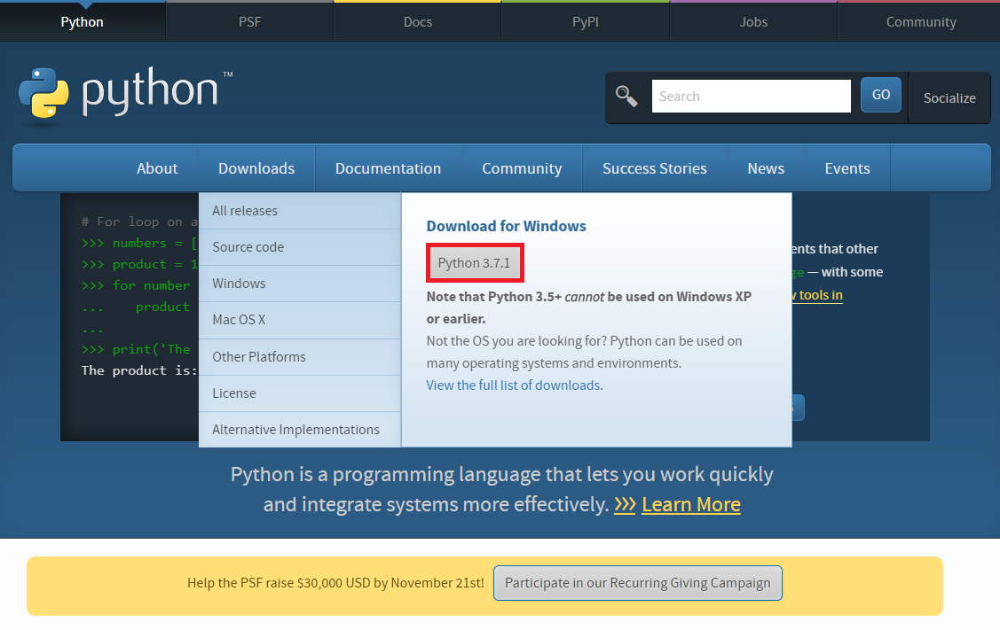 

下載完成後，執行安裝檔

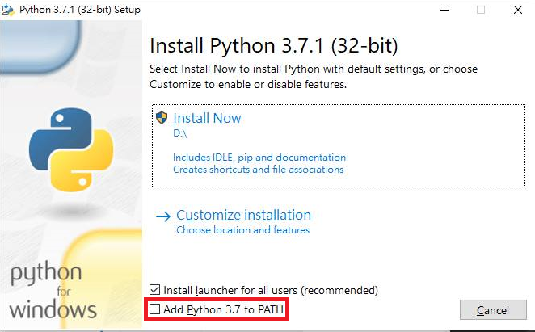 

這邊要記得勾選下方紅色框框的 Add Python 3.5 to PATH，這樣就能讓 Python 在安裝之後可以直接在命令字元提示中使用

如果要更改安裝路徑和加裝其他選項請點選 Customize iinstallation

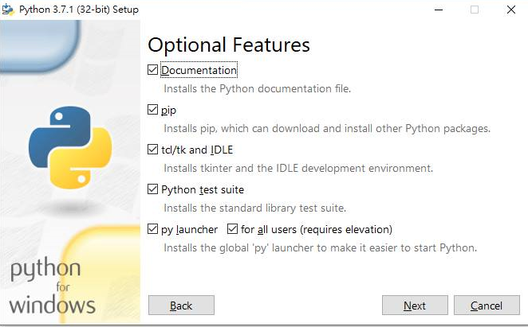 

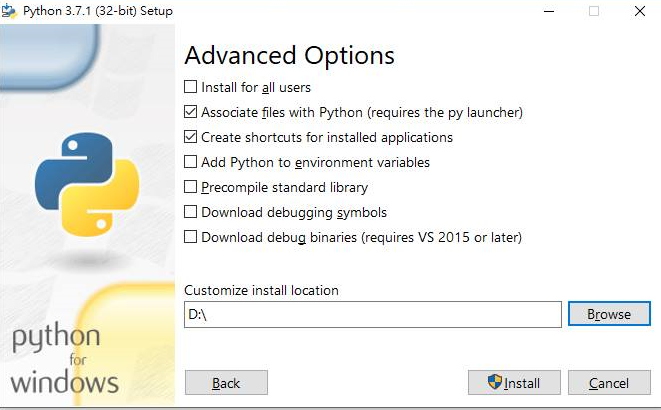 

這邊看個人需求勾選，不過建議 pip 一定要先裝好，這樣以後加裝模塊可以直接使用命令字元提示，會方便很多

全部勾選完畢後 回到第一個頁面點選 Install Now 就會開始安裝

完成之後先檢查看看 Python 有沒有安裝成功

首先滑鼠右鍵點選開始然後選擇執行，輸入cmd按下確定，打開命令字元提示

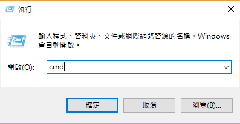 

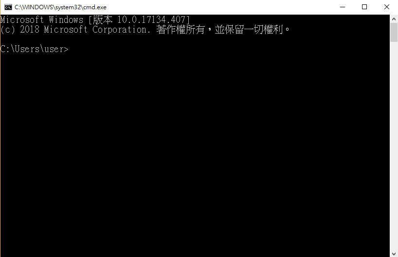 

接著在命令字元提示輸入 Python，如果出現以下畫面就表示安裝完成

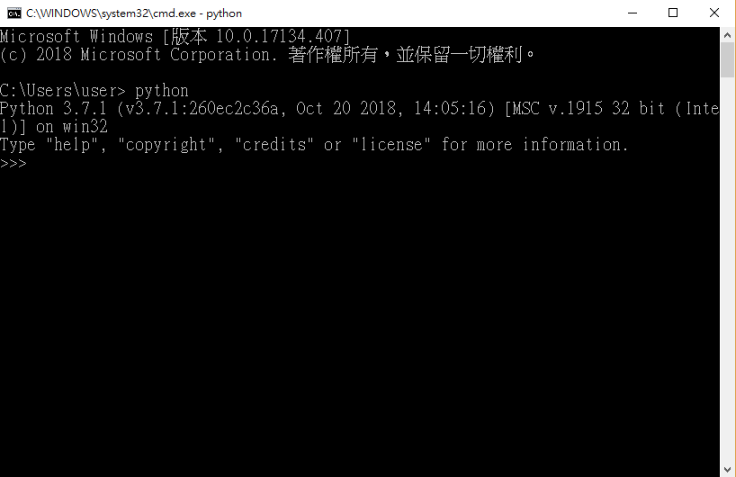 

如果你想要更新 Python 到最新版本，只要到 [Python 官方網站](https://www.python.org/) 下載最新版本的安裝檔

執行之後就會出現以下畫面，然後點選 Upgrade Now 就可以更新到最新版本

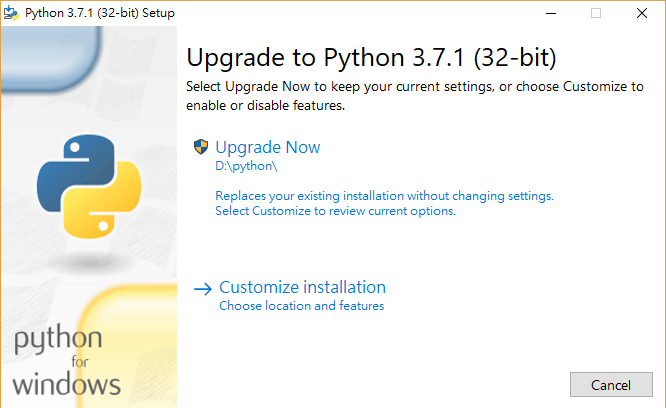 

# 在 Windows 環境下使用 pip 安裝模塊

假設我們想要安裝 pygame 這個模塊，只要輸入 pip install pygame 即可

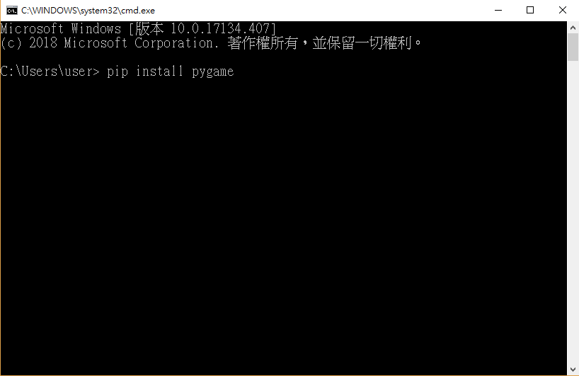 

按 enter 之後只要出現以下畫面就表示安裝完成

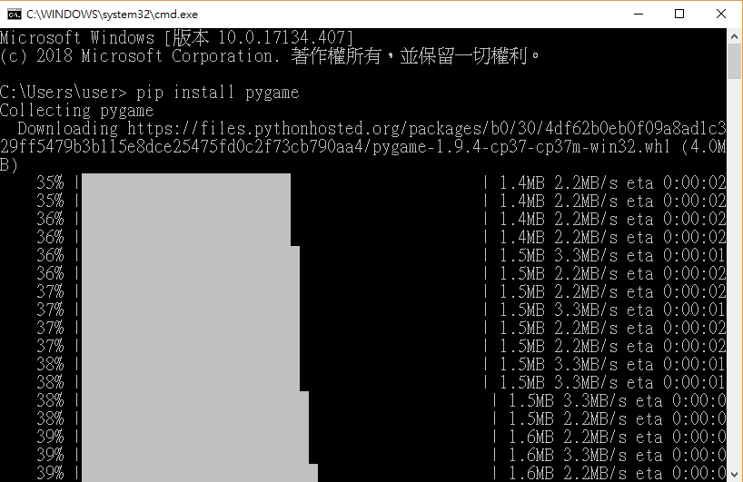 

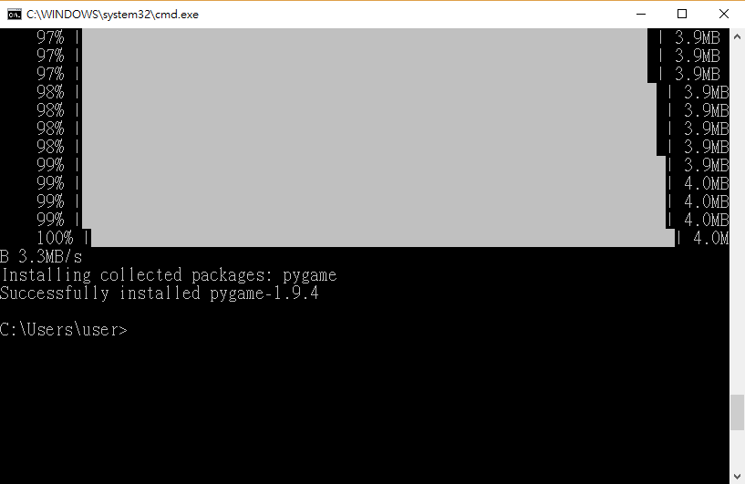 
